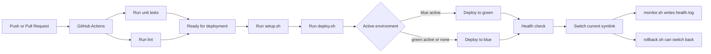
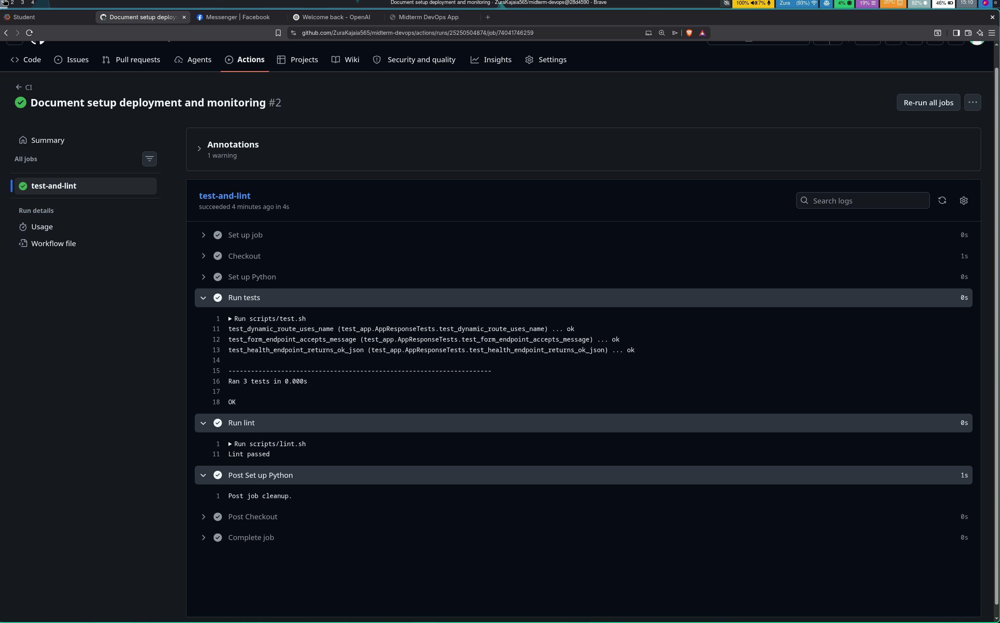
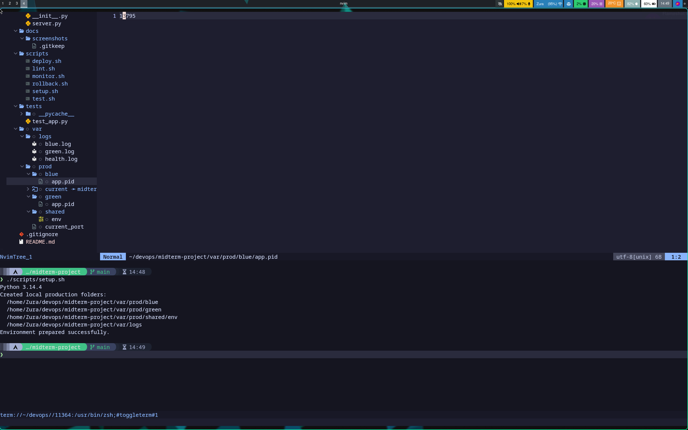
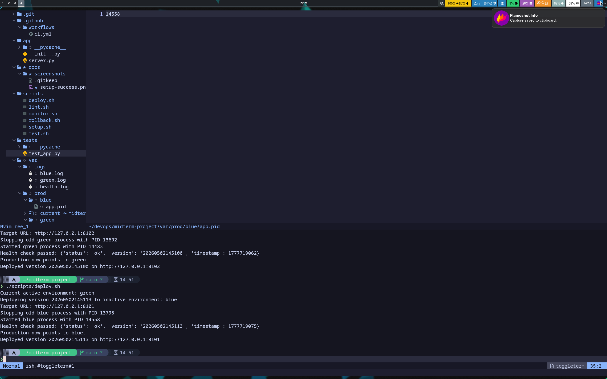
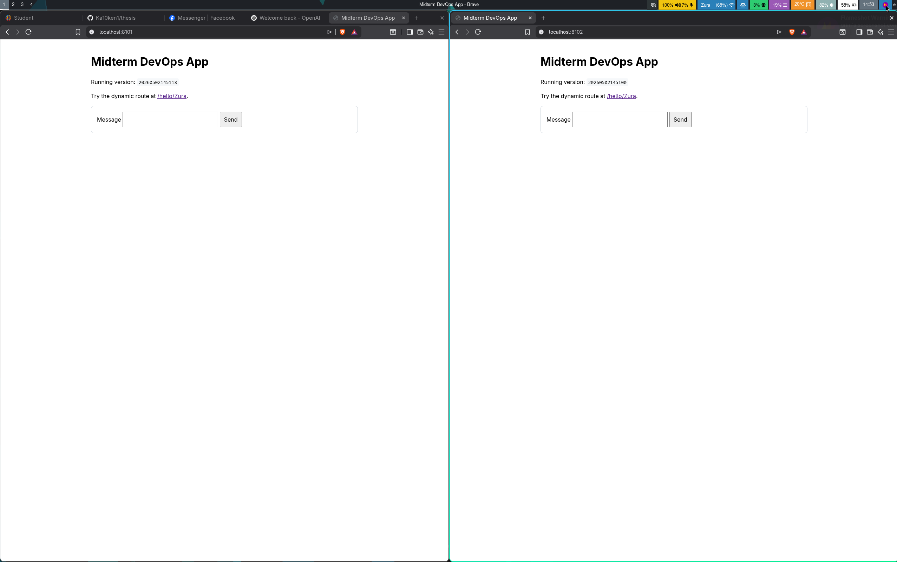
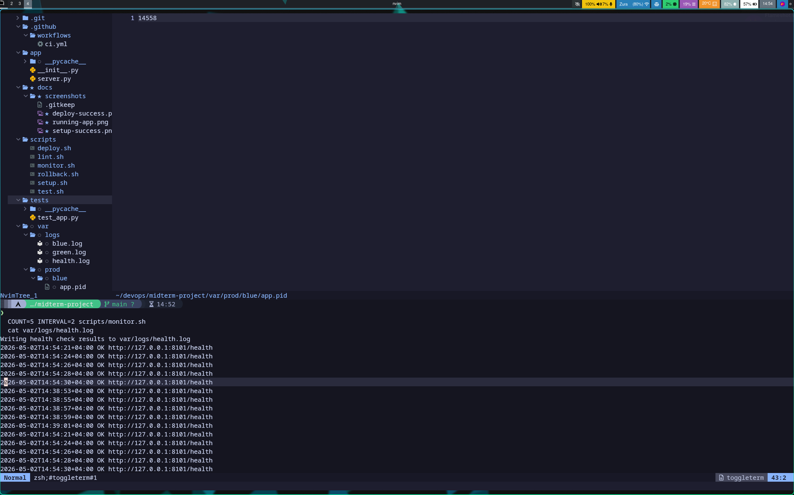

# Midterm DevOps Project

This repository contains a small Python web application and the DevOps files required for the midterm: Git workflow, CI, automated setup, local deployment, blue-green deployment simulation, rollback, and monitoring.

## Tech Stack

- Python 3
- Python standard library HTTP server
- `unittest` for unit tests
- Bash scripts for automation
- Git and GitHub
- GitHub Actions

## Project Structure

```text
midterm-project/
├── app/
│   ├── __init__.py
│   └── server.py
├── tests/
│   └── test_app.py
├── scripts/
│   ├── setup.sh
│   ├── test.sh
│   ├── lint.sh
│   ├── deploy.sh
│   ├── rollback.sh
│   └── monitor.sh
├── .github/
│   └── workflows/
│       └── ci.yml
├── docs/
│   └── screenshots/
├── .gitignore
└── README.md
```

The `var/` folder is generated when the scripts run. It is ignored by Git because it contains local runtime files, logs, process IDs, and deployment state.

## What the App Does

The web app is implemented in `app/server.py`.

- `GET /` shows the home page and an input form.
- `GET /hello/<name>` is the required dynamic route.
- `POST /message` receives the submitted form value.
- `GET /health` returns JSON used by deployment and monitoring scripts.

Example:

```bash
python -m app.server --host 127.0.0.1 --port 8000
```

Open:

```text
http://127.0.0.1:8000/
http://127.0.0.1:8000/hello/Zura
http://127.0.0.1:8000/health
```

## What Each Script Does

### `scripts/setup.sh`

This is the Infrastructure as Code / automation script. It prepares the local environment with one command:

```bash
scripts/setup.sh
```

It creates this generated folder structure:

```text
var/
├── prod/
│   ├── blue/
│   ├── green/
│   └── shared/
│       └── env
└── logs/
```

This is not a real system production directory. It is only a local project folder used to simulate production for the assignment.

The exact location after running setup is:

```text
<repository>/var/prod/
```

For example, on this machine:

```text
/home/Zura/devops/midterm-project/var/prod/
```

### `scripts/test.sh`

Runs the unit tests:

```bash
scripts/test.sh
```

The tests check the dynamic route, form endpoint, and health endpoint.

### `scripts/lint.sh`

Runs a lightweight lint check:

```bash
scripts/lint.sh
```

It checks Python syntax and trailing whitespace.

### `scripts/deploy.sh`

Simulates blue-green deployment:

```bash
scripts/deploy.sh v1
```

The first deployment usually goes to `blue`. A second deployment goes to `green`:

```bash
scripts/deploy.sh v2
```

What happens during deployment:

1. The script reads `var/prod/shared/env`.
2. It checks which environment is active: `blue`, `green`, or none.
3. It chooses the inactive environment.
4. It starts the app on that environment's port.
5. It calls `/health`.
6. If health is OK, it switches `var/prod/current` to the new environment.
7. It writes the active port to `var/prod/current_port`.

Ports:

- Blue runs on `8101`.
- Green runs on `8102`.

### `scripts/rollback.sh`

Switches production back to the previous environment:

```bash
scripts/rollback.sh
```

Rollback only works after both `blue` and `green` have been deployed and the previous environment is still running.

### `scripts/monitor.sh`

Periodically checks `/health` and writes results to a log file:

```bash
COUNT=5 INTERVAL=2 scripts/monitor.sh
```

Output log:

```text
var/logs/health.log
```

## Blue-Green Deployment Explanation

Blue-green deployment means there are two production-like environments:

- `blue`
- `green`

Only one is active at a time. If `blue` is currently active, the next version is deployed to `green`. After the new version passes the health check, production switches to `green`.

In this project, the switch is simulated with a symlink:

```text
var/prod/current -> blue
```

or:

```text
var/prod/current -> green
```

The application itself runs locally on different ports:

```text
blue  = http://127.0.0.1:8101
green = http://127.0.0.1:8102
```

## Step-by-Step Run Guide

### 1. Clone and enter the repository

```bash
git clone <your-repository-url>
cd midterm-project
```

### 2. Prepare the environment

```bash
scripts/setup.sh
```

### 3. Run tests and lint

```bash
scripts/test.sh
scripts/lint.sh
```

### 4. Deploy version 1

```bash
scripts/deploy.sh v1
```

Open the URL printed by the script.

### 5. Deploy version 2

```bash
scripts/deploy.sh v2
```

Now production switches to the other environment.

### 6. Check active production port

```bash
cat var/prod/current_port
```

### 7. Roll back

```bash
scripts/rollback.sh
```

### 8. Run monitoring

```bash
COUNT=5 INTERVAL=2 scripts/monitor.sh
```

Then view the log:

```bash
cat var/logs/health.log
```

## CI Pipeline

The GitHub Actions workflow is here:

```text
.github/workflows/ci.yml
```

It runs automatically on:

- push
- pull request

The CI job runs:

```bash
scripts/test.sh
scripts/lint.sh
```

## Git Workflow

The project should have two active branches:

```bash
git branch
```

Expected:

```text
main
dev
```

Suggested workflow:

```bash
git checkout -b dev
git add .
git commit -m "Add web app with tests"
git commit -m "Add CI workflow and automation scripts"
git checkout main
git merge dev
```

Push both branches:

```bash
git push -u origin main
git push -u origin dev
```

## Workflow Diagram



## Embedded Screenshots

Add screenshots into `docs/screenshots/` and keep these image names:

### Successful CI pipeline run



### Successful IaC execution



### Deployment process and running app





### Monitoring logs



## Final Deliverable

Paste the repository URL here before submission:

```text
<your GitHub or GitLab repository URL>
```
