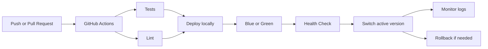

# Midterm DevOps Project

This is a small Python web app made for the DevOps midterm. It includes a web server, tests, GitHub Actions CI, setup automation, blue-green deployment, rollback, and a simple health monitor.

## Tech Stack

- Python 3
- Bash
- Git / GitHub
- GitHub Actions
- Python `unittest`

## What The App Has

- Home page with a form: `/`
- Dynamic route: `/hello/<name>`
- Form endpoint: `/message`
- Health endpoint: `/health`
- Unit tests in `tests/test_app.py`

## Project Structure

```text
app/                  Python web app
tests/                unit tests
scripts/              setup, test, deploy, rollback, monitor scripts
.github/workflows/    GitHub Actions CI
docs/screenshots/     screenshots for submission
```

When setup/deployment scripts run, they also create a local `var/` folder. This folder is ignored by Git because it contains logs and runtime files.

## How To Run

First clone the repo and enter the folder:

```bash
git clone <repo-url>
cd midterm-project
```

Prepare the local environment:

```bash
scripts/setup.sh
```

Run tests and lint:

```bash
scripts/test.sh
scripts/lint.sh
```

Run the app manually:

```bash
python3 -m app.server --host 127.0.0.1 --port 8000
```

Open:

```text
http://127.0.0.1:8000
```

## Deployment

The project uses a local blue-green deployment simulation.

`blue` and `green` are two local production environments:

```text
blue  -> http://127.0.0.1:8101
green -> http://127.0.0.1:8102
```

The generated production folders are created here:

```text
var/prod/blue
var/prod/green
var/prod/shared
```

This is not a real server production folder. It is only a local simulation for the assignment.

Deploy version 1:

```bash
scripts/deploy.sh v1
```

Deploy version 2:

```bash
scripts/deploy.sh v2
```

Check the active production port:

```bash
cat var/prod/current_port
```

Rollback:

```bash
scripts/rollback.sh
```

## Monitoring

Run health monitoring:

```bash
COUNT=5 INTERVAL=2 scripts/monitor.sh
```

View the log:

```bash
cat var/logs/health.log
```

## CI

GitHub Actions workflow:

```text
.github/workflows/ci.yml
```

It runs on every push and pull request. The pipeline runs tests and lint:

```bash
scripts/test.sh
scripts/lint.sh
```

## Git Workflow

The repository uses two branches:

```text
main
dev
```

Push both branches:

```bash
git push -u origin main
git push -u origin dev
```

## CI/CD Workflow



## Screenshots

### Successful CI pipeline


### Setup automation


### Deployment and running app


### Monitoring logs


## Repository Link

```text
<paste repository link here>
```
